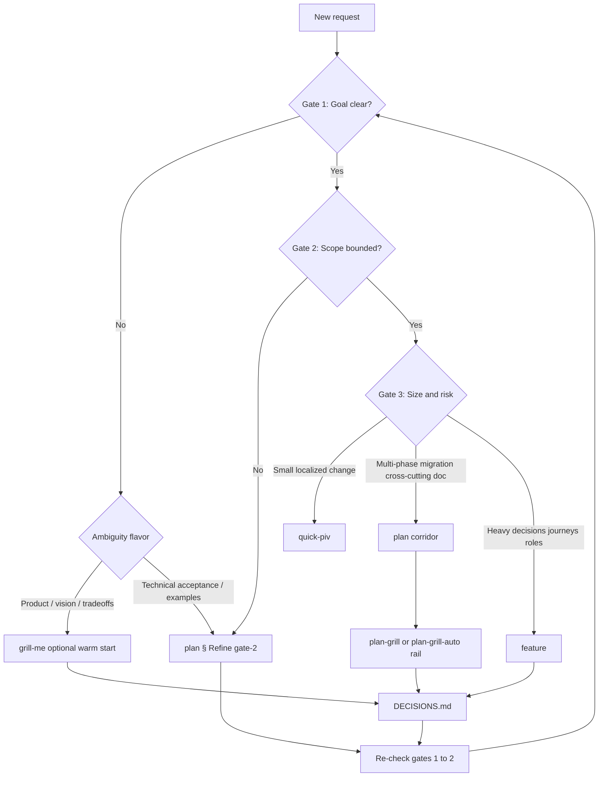

# Skill router

Use this file to pick **one primary skill** (sometimes two in sequence).

**Invocation contract (always):** After you decide the primary skill — and any secondary skill that must run **next** in order — **read that skill’s `SKILL.md` and execute its workflow starting in this same turn.** Invoking means load + follow steps, not naming a path or asking the user which skill file to open. If two skills apply sequentially (for example `plan` → `implement`), finish the first’s applicable step or hand off explicitly per that skill, then read and run the second without ending on a static routing table alone.

## `/router` — pick next action + skill

**Purpose:** `/router` means “decide the **most logical next step** for this thread, pick the skill, and **do it**.” The user should not have to name the skill.

**Resolution order (always):**

1. **Thread continuation** — active in-flight work in this conversation (see **Active thread work** below).
2. **Substantive request** — user message names a task, question, or change → **Decision model** gates + **Situation → skill** (skip backlog).
3. **Backlog intake** — only when step 1 finds **no** active thread work **and** the message is bare `/router` or equivalent idle dispatch (see **App task backlog**).

**Bare `/router`:** Message is only `/router` (optional whitespace) with **no substantive task or question**. Run step 1 first; if no active thread work, fall through to backlog intake. This is **not** `finish` and **not** “commit the working tree” unless thread continuation clearly left off at validated, landing-ready work **and** the user’s prior turn signaled wrap-up (otherwise prefer `validate` or the next implement phase — do not auto-commit).

**On continuation:** Briefly state one line — `Next: [action] → \`skill\`` — then read and run that skill. Do not re-run full backlog selection or restart gates 1–2 when the thread already has a bounded active job.

### Active thread work

Treat the thread as **mid-task** when **any** of these hold:

| Signal | Examples |
|--------|----------|
| **Conversation** | Recent turns executing `implement`, `quick-piv`, `feature`, `debug`, `grill-me`, `plan-grill`, or `plan` § Refine on a specific job; quick plan posted but implement/validate not done |
| **Open / recent files** | `documentation/jobs/temp_job_*/DEVELOPMENT_PLAN.md` or `DECISIONS.md` tied to the current job |
| **Plan state** | Active plan has pending phases, `Plan review: Required: pending`, or incomplete **Pattern & precedent** when M/L requires it |
| **Working tree** | `git status` shows changes that match the thread’s stated scope (same job/files discussed) |

**Not** active thread work: new or idle chat; prior job explicitly completed in thread; user clearly changed topic; only unrelated uncommitted files with no in-thread narrative.

**Context gather (step 1):** Skim recent thread; note open/recent job paths; run `git status -sb` when the tree may inform the next step; load the active `DEVELOPMENT_PLAN.md` when one applies.

### Thread → next skill (mid-task)

Pick **one** primary by the **most blocking** row that applies (top wins). Then invoke it.

| Thread state | Next skill |
|--------------|------------|
| Active `debug` incident; root cause unknown | `debug` |
| `feature` phase incomplete | `feature` |
| Gates 1–2 still fail **on the current job** | `grill-me` (gate 1 / optional warm start) or `plan` § Refine (gate 2). IF already inside `plan` corridor THEN product/scope forks → `plan-grill` rail (not a new standalone `grill-me`). IF user forbids questions THEN `plan-grill-auto` (not `grill-me`). |
| Plan exists; **Plan review** pending (M/L) | `review-dev-plan` |
| Plan exists; **Pattern & precedent** missing when required | `pattern-review` (`plan-section`) or resume `plan` |
| Plan exists; pending phase(s) | `implement` |
| Plan exists; XS/S in-thread extension only | `quick-piv` |
| No plan file; quick plan in chat; implement/validate incomplete | `quick-piv` |
| All planned phases done; full audit not yet run | `validate` |
| Validated; user/thread signaled landing | `finish` (only when wrap-up is the clear next step — not the default for bare `/router` on new work) |
| Pushed; CI status unknown | Read `src/config/git-workflow.json`. **Model A:** PR to `develop` open → `babysit`. **Model B:** push to `develop`/`main` → report the commit URL and stop. Do not `gh run watch`. CI is GitHub Actions after the push |

Align with [dev-cycle matrix](references/dev-cycle-matrix.md). IF active job AND repo/branch context unknown THEN run **`prime`** once, then continue with the chosen skill — do not replace thread continuation with backlog intake.

**`/finish`** is only for explicit wrap-up — read `.agents/skills/finish/SKILL.md` when the user invokes finish or asks to commit completed work (not the default idle `/router` outcome).

**Quality bar:** Listed skills were reviewed for actionable structure (clear triggers, steps, or rubrics).

---

## Decision model: goals + requirements → skill

For **new or substantive** requests — and after **Active thread work** is ruled out — route in **three gates**. Answer in order; **do not skip gate 1 or 2** to reach `plan` or `implement`. When the thread is **mid-task**, use **Thread → next skill** instead of restarting gates unless the user explicitly changes scope.

### Gate 1 — Goal / outcome

**Question:** Can you state what “done” means in one sentence, with something verifiable (demo, test, or checklist)?

| State | Meaning |
|-------|---------|
| **Clear** | Intended behavior or artifact is agreed; success is falsifiable. |
| **Unclear** | Wish or direction only; conflicting interpretations possible; “make it better” with no bar. |

If unclear, ask about the user's intended app usage, product vision, priorities, or real user journey. **First read** `documentation/DOC_APP_VISION.md` when it may already answer “who / why / what the app is for”; if it is still **`DRAFT`**, route the user to complete it (`.agents/skills/start/SKILL.md` § App vision) or treat lack of vision as ambiguity until they defer in writing. Do not route into full planning until the answer removes ambiguity.

**Bug reports** (error, broken behavior, regression — not a feature request): route to **`debug`** (§ Chat intake) before `implement` or `quick-piv`, even when gate 1 sounds “clear” on the symptom alone.

### Gate 2 — Scope / requirements

**Question:** Is **in-scope vs out-of-scope** explicit enough to choose layers and files without inventing product scope?

| State | Meaning |
|-------|---------|
| **Bounded** | Boundaries, constraints, and “not doing X” are understood (or intentionally left open **only** where documented). |
| **Unbounded** | Missing acceptance hints, unknown data/auth/API shape, or “everything flexible.” |

If the emerging direction would diverge from industry standards, framework best practices, or established repo conventions, ask whether the diversion is intentional or whether to align with best practices before routing to implementation.

**Pre-implementation — layer consistency (when cues match):** Before routing to `quick-piv`, `plan`, or direct code, check request-side cues in [`layer-consistency-check/references/workaround-shapes.md`](../layer-consistency-check/references/workaround-shapes.md) § Request-side cues — including **any change to existing behavior** (verify the user's assumption about how the system works first) and the onboarding-UI cue for integrations whose SSOT is `.env` + `src/config/app-tasks.json` + docs. If cues match, read and run [`.agents/skills/layer-consistency-check/SKILL.md`](../layer-consistency-check/SKILL.md) **first** — do not explore for implementation until the one-beat check clears or the user picks workaround vs structural path.

### Gate 3 — Delivery shape (only after gates 1–2 pass)

**Question:** How big and how risky is the **engineering** change?

| Signal | Typical skill |
|--------|----------------|
| Single area, few files, no migration / no breaking API | `quick-piv` |
| Multiple phases, migrations, cross-cutting rules, or durable handoff doc | `plan` → `implement` |
| Dense product decisions, journeys, roles, explicit approval checkpoints | `feature` |

### Clarification-first routing (gate 1 or 2 fails)

**Do not open `DEVELOPMENT_PLAN.md` yet** unless the user already invoked `/plan` or plan work has started — then stay in the **plan corridor** and use the **`plan-grill` rail** for product/scope forks (see § Plan corridor flow).

Pick by **what is missing**:

| Missing | Prefer |
|---------|--------|
| Vision, priorities, tradeoffs, UX intent **before** planning | `.agents/skills/grill-me/SKILL.md` (optional warm start → `DECISIONS.md`); ask app-usage questions until ambiguity is removed. IF user forbids questions → `.agents/skills/plan-grill-auto/SKILL.md` instead (no `grill-me`) |
| Product/scope/architecture-boundary fork **during** Refine / Investigate / Create | `.agents/skills/plan-grill/SKILL.md` via `plan` — mandatory fork checklist; anti-dup via `DECISIONS.md`. IF user forbids questions → `.agents/skills/plan-grill-auto/SKILL.md` |
| Concrete behavior, APIs, data, acceptance examples (gate 2) | Follow **Refine** in `.agents/skills/plan/SKILL.md` (gate-2 tables — stop before **Investigate** until gates pass); frame around intended app usage when product meaning is unclear |
| You lack repo grounding while clarifying | `.agents/skills/prime/SKILL.md` **before or mixed with** clarification |

After gates 1–2 pass, **re-run** the flowchart from the top (especially if the user changed scope).

### Plan corridor flow (`grill-me` → ledger → `plan` + `plan-grill` rail)

**Diagram SSOT:** [`references/skill-relationship-flow.md`](references/skill-relationship-flow.md) (sidecar — maintain with `align-harness`).

Canonical shape (do not draw `plan-grill` as a Create-only side quest):

1. **Optional warm start:** IF idea is fuzzy / gate 1 fails on vision-tradeoffs THEN `grill-me` → log Closed rows to `DECISIONS.md`. Skip when the user already has a sharp perimeter.
2. **Plan corridor:** `plan` runs Refine → Investigate → Create.
3. **`plan-grill` rail:** beside **every** corridor phase — before locking a product/scope/architecture-boundary choice, run the fork checklist (enumerate ≥2 options or justify sole option; ask on ties; log clear-winners; never invent-one-and-stamp-winner). Loop: **ask → write `DECISIONS.md` → continue the same phase**. IF user forbids questions → **`plan-grill-auto`** (same checklist; agent-pick; no Present wait; then implement).
4. **Artifacts:** `DECISIONS.md` = product/scope locks (`plan-grill` / `plan-grill-auto` / `feature`); `DEVELOPMENT_PLAN.md` = how to build. Impl-time picks go in plan § Decisions made during `implement`.
5. **M/L:** before Present, ledger must cover every product/scope lock (or explicit `no product forks — <reason>`).
6. **XS / `quick-piv`:** no `plan-grill`.

Skill SSOT for checklist/cues: `.agents/skills/plan-grill/SKILL.md`. Auto-answer variant: `.agents/skills/plan-grill-auto/SKILL.md`.

### Matrix (compact)

Rows = gate 1–2; columns = gate 3 applies only when both are **Clear / Bounded**.

| Goal | Scope | Next step |
|------|-------|-----------|
| Unclear | any | Clarify (`grill-me` and/or `plan` § Refine); optional `prime` |
| Clear | Unbounded | Bound scope (`plan` § Refine); optional `prime` |
| Clear | Bounded | Use flowchart below for `quick-piv` vs `plan` vs `feature` |

### Flowchart

Optional: run **`prime`** once when the codebase or branch context is unfamiliar — it does not replace gates 1–2.

While inside **plan corridor** (`I`), product/scope forks use **`plan-grill` rail** (checklist → ask/log → same phase) — or **`plan-grill-auto`** when the user forbids questions (checklist → agent-pick → same phase → no Present wait). Not a separate pre-plan `grill-me` unless the user leaves plan to re-open gate 1 and is willing to answer.

**Dev-cycle (SSOT):** [`.agents/skills/router/references/dev-cycle-matrix.md`](references/dev-cycle-matrix.md) — full happy path, M/L gates, and plan depth. Do not duplicate that matrix here.

---

## Situation → skill

### This repo — workflow & delivery

| Situation | Skill |
|-----------|--------|
| User sends **only** `/router` (no substantive task); see **`/router` — pick next action + skill** | Thread continuation if mid-task; else `app-tasks.json` → `prime` → `grill-me` → `quick-piv` or `plan` |
| New chat / ambiguous task; map repo rules and recent git state | `.agents/skills/prime/SKILL.md` |
| **Goal and scope clear**; non-trivial job needing phased written plan + compliance | `.agents/skills/plan/SKILL.md` |
| Plan written; qualitative critique before implementation (especially Complexity M/L) | `.agents/skills/review-dev-plan/SKILL.md` |
| Industry standard / best practice / “is this how products usually do it?” on a **plan or proposal** | `.agents/skills/pattern-review/SKILL.md` |
| Nontrivial generic subsystem (auth, queues, parsers, webhooks, protocol clients, …) — reuse a package/pattern vs build custom | `.agents/skills/dont-reinvent-the-wheel/SKILL.md` |
| New `src/features/` folder, new UI/data vendor, or “how hard to replace MUI/Vite/Supabase / modularity / stack leakage” | `.agents/skills/modularity-review/SKILL.md` |
| Ambiguous “improve / clean up / make better” on an existing area; `/improve` | `.agents/skills/improve/SKILL.md` |
| Should we align [existing product/feature/component] with industry standards? / how to align? | `.agents/skills/standards-align/SKILL.md` |
| Delete / remove / rip out / `/purge` a named feature/module/path/engine with multi-asset cleanup; leftover engine after a flag-off or replacement phase; "is the old path gone?" | `.agents/skills/purge-skill/SKILL.md` |
| Author or refine one project skill under `.agents/skills/` (`/create-skill`) | `.agents/skills/create-skill/SKILL.md` |
| Change existing behavior / unverified system assumption / workaround / “just this one” exception during implementation | `.agents/skills/layer-consistency-check/SKILL.md` (also always-on via `architecture/RULE.mdc` § Layer consistency) |
| Write a cross-repo adoption guide from an implemented pattern | `.agents/skills/write-adoption-guide/SKILL.md` |
| Goal or scope **not** ready — clarify only (no `DEVELOPMENT_PLAN.md` yet); **one** primary by missing dimension (see **Clarification-first routing**) | Product/vision → `grill-me`; user forbids questions → `plan-grill-auto`; acceptance/APIs → `plan` **§ Refine** only |
| Execute an existing `DEVELOPMENT_PLAN.md` phase by phase | `.agents/skills/implement/SKILL.md` |
| Small scoped change; plan+implement+validate in one pass | `.agents/skills/quick-piv/SKILL.md` |
| Review plan or implementation **without** editing by default; pre-merge / post-refactor gate (auto-selects plan-review / impl-full / gate depth) | `.agents/skills/validate/SKILL.md` |
| Component-level rubric (props, MUI, a11y, tests) | `.agents/skills/review/SKILL.md` |
| Version, changelog, staging gate, **local** commit | `.agents/skills/finish/SKILL.md` |
| Bundle **all** uncommitted work from multiple agent threads (same checkout), then push | `.agents/skills/bundle-ship/SKILL.md` |
| Push already committed work (after `finish`) | `.agents/skills/push/SKILL.md` |
| Bug / error / broken / regression (not a new feature) | `.agents/skills/debug/SKILL.md` — § Chat intake before code |
| Promote `develop` staging to production (`main`) | `gh workflow run promote-to-production.yml` — see `.cursor/rules/git-workflow/RULE.mdc` § Promote to production (not `finish`, not a squash PR) |
| User asks to PR / merge `develop` → `main`, or "release to production" (colloquial) | **Same as promote** — run `gh workflow run promote-to-production.yml`; **never** `gh pr create --base main --head develop` |
| Human onboarding; README quick start + dev task backlog | `.agents/skills/start/SKILL.md` (includes **App vision** gate → `documentation/DOC_APP_VISION.md`) |

### This repo — product & codebase shape

| Situation | Skill |
|-----------|--------|
| Full feature request with mandatory decision stops and phased spec | `.agents/skills/feature/SKILL.md` |
| Scientific debugging; hypotheses; user supplies runtime evidence | `.agents/skills/debug/SKILL.md` |
| Pre-registered hypothesis loop; naive fixes failed or user invokes hypothesis mode | `.agents/skills/hypothesis/SKILL.md` |
| Ultra-compressed communication (`/caveman`, "be brief", "less tokens") | `.agents/skills/caveman/SKILL.md` (overlay — not a workflow step) |
| Stress-test product/design when gates 1–2 already pass (not gate-1 ambiguity); optional warm start before plan | `.agents/skills/grill-me/SKILL.md` |
| Product/scope fork during plan corridor (Refine/Investigate/Create); `/plan-grill`; **rail invoked by `plan`** — mandatory checklist | `.agents/skills/plan-grill/SKILL.md` |
| Same rail, user forbids questions (`/plan-grill-auto`, "answer yourself", "don't ask me", "I won't check, only test") | `.agents/skills/plan-grill-auto/SKILL.md` — agent picks; writes `DECISIONS.md`; no Present wait |
| Simplify **one** concrete feature (flows + code), reduce steps/complexity | `.agents/skills/challenge/SKILL.md` |
| Find duplication in a **named target** (folder, feature, layer, glob) or whole `src/` if asked; consolidation candidates; semantic placement (after tooling is green) | `.agents/skills/consolidate/SKILL.md` |
| Optimize hotspots: design → approach → efficiency → complexity | `.agents/skills/optimize2/SKILL.md` |
| React perf patterns (bundle, waterfalls, re-renders) for Vite SPA | `.agents/skills/react-perf-vite/SKILL.md` |
| Retro from failures/diffs; persist lessons into rules or skills | `.agents/skills/learn/SKILL.md` |
| Audit/improve the **agent harness** (AGENTS, rules, skills, INDEX, layers); subagent lenses + no-loss pass | `.agents/skills/align-harness/SKILL.md` |
| Intake **external** harness content from `.agents/harness-inbox/` | `.agents/skills/update-harness/SKILL.md` |
| Grade **or** improve an attached rule/command file (rubric score and/or quality rewrite) | `.agents/skills/rule-quality/SKILL.md` |

### This repo — integrations

| Situation | Skill |
|-----------|--------|
| Research/integrate an external API or backend (MCP-first, schema→sample discipline) | `.agents/skills/api-integrate/SKILL.md` |

### User-level Cursor skills (`~/.cursor/skills-cursor/`)

| Situation | Skill |
|-----------|--------|
| Author or refine a project skill under `.agents/skills/` | `.agents/skills/create-skill/SKILL.md` (this repo SSOT; `~/.cursor/skills-cursor/create-skill` is reference-only here) |
| Migrate `.mdc` rules / slash commands → skills | `~/.cursor/skills-cursor/migrate-to-skills/SKILL.md` |
| Create `.cursor/rules` `.mdc` guidance | `~/.cursor/skills-cursor/create-rule/SKILL.md` |
| Cursor hooks (`hooks.json`, hook scripts) | `~/.cursor/skills-cursor/create-hook/SKILL.md` |
| Custom subagents | `~/.cursor/skills-cursor/create-subagent/SKILL.md` |
| PR merge-ready loop (comments, conflicts, CI) | `~/.cursor/skills-cursor/babysit/SKILL.md` |
| Split work into small PRs | `~/.cursor/skills-cursor/split-to-prs/SKILL.md` |
| Standalone analytical UI artifact (`.canvas.tsx`) | `~/.cursor/skills-cursor/canvas/SKILL.md` |
| IDE `settings.json` | `~/.cursor/skills-cursor/update-cursor-settings/SKILL.md` |
| CLI `~/.cursor/cli-config.json` | `~/.cursor/skills-cursor/update-cli-config/SKILL.md` |
| CLI status line | `~/.cursor/skills-cursor/statusline/SKILL.md` |
| User typed `/shell` — run remainder literally | `~/.cursor/skills-cursor/shell/SKILL.md` |

### Plugin skills (paths vary by install; discover under `~/.cursor/plugins/`)

| Situation | Skill (name) |
|-----------|----------------|
| Any Supabase product (Auth, DB, Edge, Realtime, Storage, MCP, migrations) | `supabase` |
| Postgres query/schema performance, pooling, RLS performance | `supabase-postgres-best-practices` |
| Cloudflare platform routing (“what product do I use?”) | `cloudflare` |
| Wrangler CLI commands and config | `wrangler` |
| Workers code author/review, anti-patterns | `workers-best-practices` |
| Durable Objects design/review | `durable-objects` |
| Agents SDK reference-heavy agent work | `agents-sdk` |
| Generate/deploy AI agent app on Cloudflare | `building-ai-agent-on-cloudflare` |
| Remote MCP server on Workers | `building-mcp-server-on-cloudflare` |
| Untrusted code execution / sandbox | `sandbox-sdk` |
| Core Web Vitals / Lighthouse-style audit (Chrome DevTools MCP) | `web-perf` |

---

## When more than one skill seems relevant

Choose by **primary outcome** (what must be true when done). If two outcomes are required, run skills **in order** (e.g. plan → implement → validate → finish). Use **Decision model** above first: neither `plan` nor `feature` should start until gates 1–2 pass (unless you are intentionally only running **`plan` § Refine** or **`grill-me`**).

### `plan` vs `feature`

- **`plan`:** Engineering execution plan (`DEVELOPMENT_PLAN.md`, phases, gates, repo compliance). Use when gates 1–2 are **Clear / Bounded** and the gap is **structured implementation**, not discovery of what to build.
- **`feature`:** Deep product/requirements process with **mandatory user decision stops** and journey mapping. Use when gate 3 calls for **high decision density** (roles, journeys, approvals) even though gates 1–2 may be partly filled as you go — still clarify unknowns early within that skill, especially app-usage ambiguity and intentional standards diversions.
- **Auto vs `feature`:** IF `plan-grill-auto` triggers are active and the user did **not** invoke `/feature`, route to the `plan` corridor with the auto rail — not `feature`. `/feature` or “ask me” turns auto off and `feature` 🔴 stops apply.

### `plan` vs `quick-piv`

- **`quick-piv`:** Single pass; chat-sized plan OK; small scope.
- **`plan`:** Multi-phase, migrations, breaking changes, or anything needing a durable plan file others can follow.

### `validate` (auto-selects depth)

- **`validate`** auto-selects depth from context: **plan-review** (plan only), **impl-full** (rules + tooling + plan-compliance after implementing against a plan), or a lighter **gate** (pre-merge/post-refactor structural confidence on a diff with no governing plan). No user mode input needed. See `.agents/skills/validate/SKILL.md` § Mode auto-selection.

### `validate` gate vs `consolidate` § Semantic placement

- **`validate` (gate mode):** Routine pre-merge gate on current scope (rule subagents + scripts).
- **`consolidate` § Semantic placement mode:** After linters pass — **semantic** placement, duplication, cross-feature boundaries, refactoring impact.

### `consolidate` vs `optimize2`

- **`consolidate`:** Redundancy **audit of a Target** (folder / feature / layer / glob; whole `src/` only if asked). **Sweep `src/`** for copies; **focus** report/execute on Target ∪ 1-hop callers/callees. Prioritize with `references/warrant-rubric.md`. Default: report then stop.
- **`optimize2`:** **Hotspot** optimization at four levels for chosen code; Rule of Three for extractions. Use for **hot paths** or known-complex modules.

### `consolidate` — Redundancy audit vs Semantic placement mode

- **Redundancy audit (default):** “What repeats **around this Target**?” Sweep `src/`; focus Target ∪ 1-hop. Unify abstractly (may stay duplicated by decision). Report then stop unless execute was requested.
- **Semantic placement mode:** “Is code in the **wrong** layer/feature?” → move/refactor for boundaries (after tooling is green).

### `challenge` vs `optimize2`

- **`challenge`:** Question whether the **feature or workflow** should exist or be simpler (remove/merge steps).
- **`optimize2`:** Improve existing code **without** necessarily changing product scope.

### `debug` vs `hypothesis`

- **`debug`:** Default for runtime incidents — event chains, user-supplied evidence, iterative narrowing (`.agents/skills/debug/SKILL.md`).
- **`hypothesis`:** Pre-registered root-cause experiment when naive fixes already failed or the user invokes hypothesis mode (`.agents/skills/hypothesis/SKILL.md`).
- **Tiebreak:** User asks for hypothesis / repeated failed fixes → `hypothesis`; otherwise → `debug`. Cross-link both skills; do not run both as equal primaries in one pass.

### `debug` vs `learn`

- **`debug`:** Active incident; hypotheses; runtime evidence; possibly temporary instrumentation.
- **`learn`:** Capture durable rule/skill/debug-pattern updates. **Proactive** learn waits until the struggle is resolved (not as primary beside active `debug`). **Manual** `/learn` (user invoked or skill attached) runs **in that turn**, including on a still-red CI/incident message — do not defer behind the fix. Procedure: `.agents/skills/learn/SKILL.md` § Turn contract.

### `rule-quality` vs `learn`

- **`rule-quality`:** Score (Mode A) or rewrite (Mode B) **provided rule/command text**.
- **`learn`:** Decide **where** lessons live (rules vs skills vs debug appendix) from incident context.

### `align-harness` vs `update-harness` vs `learn`

- **`align-harness`:** In-repo harness coherence (skills + rules + AGENTS + INDEX + layers).
- **`update-harness`:** External drops in `.agents/harness-inbox/` — disposition report + confirmed apply.
- **`learn`:** Session lesson from a mistake; removal-first; structural conflicts → `align-harness`.

### `align-harness` vs `rule-quality` / `consolidate`

- **`align-harness`:** **Harness-wide** audit — separation of concerns, SSOT, conflicts, handoffs — via parallel lens subagents and a no-information-loss gate. Edits harness corpus + router/layers spine.
- **`rule-quality`:** One **rule/command file's** grade or prose. **`consolidate`:** duplication in **`src/` application code**, not skills.

### `rule-quality` vs `review`

- **`rule-quality`:** Grade or improve **rules/commands** (rubric + quality standards).
- **`review`:** Score **React/MUI components** with component rubric.

### `grill-me` vs `plan-grill` vs `plan-grill-auto` vs `plan` § Refine

- **`grill-me`:** **Optional warm start** before the plan corridor — product/design Q&A when gate 1 fails on vision/tradeoffs, or explicit stress-test / “grill me.” Logs Closed rows to `DECISIONS.md`. Prefer closing more here so the corridor asks less. Includes optional **Zoom out first** (formerly `stepback`).
- **`plan-grill`:** **Rail beside every plan corridor phase** (Refine / Investigate / Create). Same ask style as `grill-me`; **mandatory fork checklist** before locking (enumerate ≥2 options or justify sole; ask on ties; log clear-winners; anti-dup). Loop: ask → `DECISIONS.md` → **same phase**. Not a Create-only side quest. Not for XS/`quick-piv`. Not for industry precedent (`pattern-review`).
- **`plan-grill-auto`:** Same rail and checklist as `plan-grill`, but the **agent answers every fork**. No questions, no Present wait, then `implement` so the user can test. Ledger `source: plan-grill-auto`.
- **`plan` § Refine:** Split — product/scope/architecture-boundary → **`plan-grill` rail** (or **`plan-grill-auto`** when the user forbids questions); gate-2 acceptance/API examples → stay in Refine. Full corridor after gates 1–2 (or when user already started `/plan`).

**Tiebreak:** Fuzzy idea + not yet planning + user will answer → `grill-me`. Already in `plan` / user said `/plan` → `plan-grill` for product forks. User forbids questions (`/plan-grill-auto`, “answer yourself”, “I won’t check”) during a **plan corridor** → `plan-grill-auto` (wins over `grill-me`, `plan-grill`, and `feature` unless they invoked `/feature`). Bug reports → `debug` (auto does not mute intake). Protected-file, `finish`, and `push` confirms still ask. Gate-2 examples only → Refine without `plan-grill`.

### `prime` vs `start`

- **`prime`:** Agent loads **technical** context for implementation.
- **`start`:** Human **first-time setup** walkthrough.

### `finish` vs `push` vs `bundle-ship` vs `babysit`

- **`finish`:** Commit-ready locally (version, changelog, staging rules); emits **Ready for you to test** handoff (§ User test).
- **`bundle-ship`:** Multi-thread same-checkout landing — one bundled `finish` commit, then `push` in one invocation.
- **`push`:** Remote sync only **after** commits exist; never commit inside push.
- **`babysit` / post-push CI:** Read `src/config/git-workflow.json`. **Model A:** after successful **`push`** that created or updated a PR to **`develop`**, read and run **`babysit`** (`~/.cursor/skills-cursor/babysit/SKILL.md`) unless waived in **Decisions made**. **Model B:** after successful push to **`develop`** or **`main`**, report the commit URL and stop. Do **not** `gh run watch` or block the checkout on Actions. Do **not** require a PR. If the user later brings a failed check → `ci-investigator` or fix in scope and re-push.

### `canvas` vs `validate` / reporting

- **`canvas`:** Standalone **visual artifact** (tables, timelines, rich layouts) as deliverable.
- **`validate`:** Structured **text report**; default no edits.

### External API research: `api-integrate` vs stack plugin skills

- **`.agents/skills/api-integrate/SKILL.md`:** Use for an **unfamiliar/new** vendor or API — MCP-first check, then Phase 1 schema/contract → Phase 2 sample/wire-shape discipline (the same two-phase order the retired `airtable-inspect` skill used, now generalized). Worked examples: Supabase (MCP path), Airtable (no-MCP path).
- **Stack plugin skill** (`supabase`, `cloudflare`, `wrangler`, etc.): Use for **operating inside a stack you're already on** — see the Supabase/Cloudflare disambiguations below. Don't route routine stack work through `api-integrate`.
- **A fork's own vendor-specific skill** (if one exists, e.g. a fork-added `stripe-inspect`): prefer it when it's more specific than the generic `api-integrate` path — don't force every integration through one skill.
- See also `.cursor/rules/api-integration/RULE.mdc` for the globs-scoped principles this skill implements (`alwaysApply: false`).

### Supabase: `supabase` vs `supabase-postgres-best-practices` vs `api-integrate`

- **`supabase`:** Product workflows, Auth, RLS correctness, CLI/MCP, migrations narrative — operating inside this fork's already-configured backend.
- **`supabase-postgres-best-practices`:** **Performance** tuning, query plans, indexing, pooling — narrow DB optimization.
- **`api-integrate`:** Only if researching Supabase itself as an unfamiliar vendor (rare in this repo, since it's already configured) — see § External API research above.

### Cloudflare: `cloudflare` vs `wrangler` vs `workers-best-practices`

- **`cloudflare`:** Pick **product** (Workers vs Pages vs DO vs R2…).
- **`wrangler`:** **CLI** syntax and deploy/dev workflow.
- **`workers-best-practices`:** **Code/config review** against current Workers guidance.

### Cloudflare agents: `agents-sdk` vs `building-ai-agent-on-cloudflare`

- **`agents-sdk`:** Reference-led SDK usage (state, RPC, docs fetch).
- **`building-ai-agent-on-cloudflare`:** End-to-end **generated** agent app and deployment narrative.

### `building-mcp-server-on-cloudflare` vs `agents-sdk` (MCP sections)

- **`building-mcp-server-on-cloudflare`:** **Expose** tools as remote MCP with OAuth/deploy.
- **`agents-sdk`:** **Consume** or embed MCP patterns inside Agents SDK — use when agent wiring dominates.

### `web-perf` vs `optimize2` vs `react-perf-vite`

- **`web-perf`:** **Browser-measured** performance (CWVs, network, traces via DevTools MCP).
- **`optimize2`:** **Code-level** structure and complexity optimization (may include perf but not Lighthouse-centric); Rule of Three for extractions.
- **`react-perf-vite`:** **Pattern lookup** for stack-native React perf (lazy routes, TanStack dedup, re-render rules) — read `rules/` on demand; does not replace hotspot refactor.

**Order when multiple apply:** measure with **`web-perf`** if symptoms are CWV/Lighthouse → structural fix with **`optimize2`** → cite specific **`react-perf-vite`** rules while implementing.

### Plan review stack (ordered pipeline)

When the user asks to **review a plan** or before **implement** on Complexity **M/L**, run **in order** — do not pick multiple primaries for the same pass:

1. **`dont-reinvent-the-wheel`** during **`plan`** Investigate (and `feature` § 3.1a) when the work is a generic subsystem not obviously covered — recommendation only; skip when bespoke.
2. **`pattern-review`** (`plan-section`) during **`plan`** step 5 when M/L or new user-visible/contracts — fills **Pattern & precedent** in the plan.
3. **`review-dev-plan`** when Summary says `Plan review: Required: pending` (mandatory for M/L).
4. **`validate`** (plan-review mode) for **repo rule** compliance on the plan document.

Do **not** run standalone **`pattern-review`** `scan` in the same session if **`review-dev-plan`** already ran the industry-precedent lens (unless the user requests a delta review).

### `dont-reinvent-the-wheel` vs `pattern-review` vs `api-integrate`

- **`dont-reinvent-the-wheel`:** Should we **depend on a package** or **model a verified public implementation** instead of writing custom code for a generic subsystem? Live search; stops at a recommendation.
- **`pattern-review`:** Does this **design** match **external industry / product precedent** for the capability?
- **`api-integrate`:** How do we **research this vendor’s contract** (MCP → schema → sample) once we are integrating an API?

**Order when both apply:** **`dont-reinvent-the-wheel` first** (may pick an SDK and skip raw API work). If still integrating a vendor API → **`api-integrate`**. Then **`pattern-review`** on the chosen approach (M/L or new contracts).

**Tiebreak:** User asks “which library / don’t build this ourselves” → **`dont-reinvent-the-wheel`**. “Is this how products usually do it?” → **`pattern-review`**. “How does this vendor’s API work?” → **`api-integrate`**.

### `modularity-review` vs `validate` vs `review-dev-plan` vs `layer-consistency-check`

- **`modularity-review`:** Explain **replaceability** (Score A features / Score B stack) and whether a **new stack-port cruiser rule** is needed. Run `pnpm arch:check` + `pnpm modularity:report`. Do not unwrap production imports unless asked.
- **`validate`:** Pass/fail of **all** repo rules, including `stack-port-*`. Not a replaceability readout.
- **`review-dev-plan` “modularity” lens:** Critique of a **plan document**, not live `src/` scores.
- **`layer-consistency-check`:** Before writing a **workaround**. This skill **after** a module or vendor exists.

**Order:** `dont-reinvent-the-wheel` first when adding a package → install/plan → **`modularity-review`**. `layer-consistency-check` first when changing existing behavior. `validate` after implement (includes the ratchet).

### `pattern-review` vs `layer-consistency-check`

- **`pattern-review`:** Does this design match **external industry / product precedent** for the capability?
- **`layer-consistency-check`:** Does this request fit the **internal** layer beneath it (abstraction hierarchy, architecture, physics/math) — or are we about to ship a workaround?

**Order when both apply:** **`layer-consistency-check` first** (one-beat check). If the user picks a structural path that changes UX/API contracts, run **`pattern-review`** before implementing.

### `improve` vs specialized improve skills

- **`improve`:** Product-facing **facade** — plain-language target, optional vision, ≤3 findings, then invokes one child skill. Use when the user has not named a technique.
- **`standards-align` / `challenge` / `consolidate` / `validate` / `review`:** Named technique already clear → skip facade.
- **`layer-consistency-check` / `pattern-review` / `dont-reinvent-the-wheel`:** Proactive guards stay always-on; `improve` may also route a finding into `layer-consistency-check`.
- **`optimize2` / `react-perf-vite`:** Named hotspot or Vite SPA perf symptom → those skills; vague “make better/faster” without a named hotspot → **`improve`** first (may recommend optimize/perf as a finding).
- **`grill-me`:** Gate-1 vision/tradeoff ambiguity, or explicit stress-test when gates already pass → **`grill-me`**. Vague quality on an existing area → **`improve`** (vision Qs only if thin).

**Tiebreak:** Vague “make better” / `/improve` → **`improve`**. Specific “align with industry” → **`standards-align`**. Specific “simplify this flow” → **`challenge`**. Named perf hotspot → **`optimize2`** or **`react-perf-vite`**. Gate-1 unclear product intent → **`grill-me`**.

### `create-skill` vs `align-harness` vs `rule-quality`

- **`create-skill`:** One new/refined `.agents/skills/<name>/SKILL.md` (this repo).
- **`align-harness`:** Whole-corpus coherence audit.
- **`rule-quality`:** Grade/rewrite one **rule/command** file (not skill authoring).

### `standards-align` vs `pattern-review` vs `challenge`

- **`pattern-review`:** Proactive (and on-demand) **evaluate** a plan/proposal vs industry — verdict + Pattern risk A/B/C. Does **not** own the full “should we realign this existing scope + how to simplify toward standards” loop.
- **`standards-align`:** On-demand loop for an **existing** product/feature/component: **should we align?** → gap score → how A/B/C → hand off. Reuses the `pattern-review` rubric; does not replace proactive plan gates.
- **`challenge`:** Simplify **one** named feature/workflow (fewer steps/code) when the question is overbuilt — not primarily “vs market.”

**Tiebreak:** User asks should/how **align with industry** on existing scope → **`standards-align`**. Novel plan/proposal gate → **`pattern-review`**. “This flow is overbuilt” without industry framing → **`challenge`**.

**Always-on:** layer-consistency is enforced during implementation via `architecture/RULE.mdc` § Layer consistency — not only when the user names the skill.

### `implement` vs `quick-piv`

- **`implement`:** Active `DEVELOPMENT_PLAN.md` with multi-phase or durable execution — phase-by-phase SSOT.
- **`quick-piv`:** **XS/S** scope only; chat-sized extension or no plan file. **Never** when plan **Complexity** is **M/L** or **Plan review** is pending — use **`implement`** after gates pass.

### `debug` vs `quick-piv`

- **`debug`:** Unknown cause, need hypotheses and runtime evidence.
- **`quick-piv`:** Root cause known; small scoped fix with clear gate.

### `challenge` vs `feature`

- **`feature`:** Net-new capability with mandatory 🔴 decision stops and journey mapping.
- **`challenge`:** Simplify an **existing** named feature/workflow (flow + code).

### `start` — onboarding

- **`start`:** Human first-time setup via README + dev task backlog (`/tasks`); app vision gate.

### `prime` vs clarification skills

- **`prime`:** Optional **once** for technical repo context — not a substitute for gates 1–2.
- **Order when both needed:** `prime` (if unfamiliar) → **`grill-me`** (optional warm start) **and/or** `plan` § Refine (gate 2) → re-run gates → **`plan` corridor** with **`plan-grill` rail** (or **`plan-grill-auto`** if the user forbids questions; or `feature` / `quick-piv` per gate 3).

### `review` vs `optimize2`

- **`review`:** Qualitative **component** rubric score (170-point).
- **`optimize2`:** Structural/perf refactor of a **hotspot** at four levels.

### `quick-piv` vs `validate`

- **`quick-piv`:** Inline tooling checks only (“quick validate”) — not the **`validate`** skill fan-out.
- **`validate`:** Full rule subagents + plan-compliance when the user asks to validate or before merge/finish.

### `feature` vs `plan` / `implement` (orchestrator)

- **`feature`:** Primary outcome = product/requirements artifact + mandatory decision stops. **Not** the durable execution plan.
- **`plan`:** Produces `DEVELOPMENT_PLAN.md`. **`implement`:** Executes it. After **`feature`** Phase 4, run **`plan`** (or ensure `DEVELOPMENT_PLAN.md` exists) before **`implement`**.

### `quick-piv` (orchestrator)

- **Primary outcome:** Land a **small** scoped change in one session. Compresses plan/implement/validate steps — defers to **`validate`**, **`finish`**, and full **`plan`** for M/L, commits, and durable plans.

### Thread continuation vs backlog intake

- **Thread continuation:** Mid-task `/router` — resume the active job via **Thread → next skill**; do not read `app-tasks.json` first.
- **Backlog intake:** Idle thread + bare `/router` — pick from `app-tasks.json` per **App task backlog**.
- **Conflict:** If thread work and backlog `in-progress` disagree, **thread wins** unless the user explicitly asks to switch tasks.

### Bare `/router` vs `finish` (situation table)

- **Bare `/router`** (no task text): **next-action dispatch** — **Active thread work** first; only when idle, **backlog intake** from `src/config/app-tasks.json`. **Not** default `finish` on new/idle dispatch.
- **`/finish`:** explicit wrap-up — includes archiving the session task when applicable (see `finish` skill). Not the default for idle `/router`.

### App task backlog (SSOT)

- **Active:** `src/config/app-tasks.json` (`to-do` | `in-progress` only; array order = priority).
- **Archive:** `src/config/app-tasks-archive.json` (`done` only; append order = completion timeline). **Do not read** unless the user asks for completed history.
- **Coding agent pick up:** when the assistant **commits to execute** a backlog task, set `in-progress` in the active file **in the same turn** before `prime`, `grill-me`, `plan`, or code. User edits in `/tasks` UI do **not** trigger pick-up.
- **Onboarding tasks:** Fresh clones ship five seeded tasks (Supabase, Hosting, App vision, Airtable optional, Theme). Agents sync status at session boundaries per `start`, `router`, and `finish` — edit JSON directly or via `/__dev/tasks` when dev server runs. Disk-wins on UI conflicts.
- **Backlog intake** (fallback only — after **Active thread work** is ruled out):
  - Read only `src/config/app-tasks.json`.
  - If `in-progress` exists: ask continue that task vs first `to-do` by list order.
  - Else select first `to-do` by list order.
  - Apply pick up for the chosen task (skip if already `in-progress`).
  - Then `prime` (if needed) → `grill-me` unless `title` + `description` satisfy gates 1–2 → `quick-piv` or `plan` / `feature` per gate 3.
- If no actionable `to-do` or `in-progress`: say so; optional `prime` for repo context — do **not** invent tasks and do **not** default to `finish`.

---

## Skill index (paths)

### Project (this repo)

- `.agents/skills/router/SKILL.md` — this file
- `documentation/DOC_APP_VISION.md` — product SSOT (problem, persona, app’s role)
- `.agents/skills/plan/SKILL.md`
- `.agents/skills/implement/SKILL.md`
- `.agents/skills/validate/SKILL.md` (auto-selects plan-review / impl-full / gate depth)
- `.agents/skills/consolidate/SKILL.md`
- `.agents/skills/review/SKILL.md`
- `.agents/skills/finish/SKILL.md`
- `.agents/skills/bundle-ship/SKILL.md`
- `.agents/skills/push/SKILL.md`
- `.agents/skills/quick-piv/SKILL.md`
- `.agents/skills/prime/SKILL.md`
- `.agents/skills/start/SKILL.md` (onboarding via README + dev task backlog)
- `.agents/skills/learn/SKILL.md`
- `.agents/skills/challenge/SKILL.md`
- `.agents/skills/feature/SKILL.md`
- `.agents/skills/debug/SKILL.md`
- `.agents/skills/hypothesis/SKILL.md`
- `.agents/skills/caveman/SKILL.md` (communication overlay — not workflow)
- `.agents/skills/rule-quality/SKILL.md`
- `.agents/skills/align-harness/SKILL.md`
- `.agents/skills/update-harness/SKILL.md`
- `.agents/skills/optimize2/SKILL.md`
- `.agents/skills/react-perf-vite/SKILL.md`
- `documentation/DOC_REACT_PERF.md` — human overview (links to skill)
- `.agents/skills/api-integrate/SKILL.md`
- `.agents/skills/grill-me/SKILL.md`
- `.agents/skills/plan-grill/SKILL.md`
- `.agents/skills/plan-grill-auto/SKILL.md`
- `.agents/skills/pattern-review/SKILL.md`
- `.agents/skills/dont-reinvent-the-wheel/SKILL.md`
- `.agents/skills/modularity-review/SKILL.md`
- `.agents/skills/improve/SKILL.md`
- `.agents/skills/standards-align/SKILL.md`
- `.agents/skills/purge-skill/SKILL.md`
- `.agents/skills/create-skill/SKILL.md`
- `.agents/skills/layer-consistency-check/SKILL.md`
- `.agents/skills/review-dev-plan/SKILL.md`
- `.agents/skills/write-adoption-guide/SKILL.md`

### Router references (not skills)

- `.agents/skills/router/references/dev-cycle-matrix.md` — dev-cycle happy path and M/L gates (SSOT)
- `.agents/skills/router/references/skill-relationship-flow.md` — grill / plan corridor / plan-grill rail diagram (SSOT; `align-harness` maintains; includes `plan-grill-auto`)

### User Cursor bundle (`~/.cursor/skills-cursor/`)

- `migrate-to-skills`, `create-rule`, `create-hook`, `create-subagent`, `babysit`, `split-to-prs`, `canvas`, `update-cursor-settings`, `update-cli-config`, `statusline`, `shell` — each under its own folder `SKILL.md`. (Project skill authoring: `.agents/skills/create-skill/` — see project index.)

### Plugins

Resolve paths via workspace MCP descriptors or `~/.cursor/plugins/cache/` — skill names: `supabase`, `supabase-postgres-best-practices`, `cloudflare`, `wrangler`, `workers-best-practices`, `durable-objects`, `agents-sdk`, `building-ai-agent-on-cloudflare`, `building-mcp-server-on-cloudflare`, `sandbox-sdk`, `web-perf`.

---

## Not present in this workspace

The agent inventory may list skills that are **not** checked into this repo (e.g. generic architecture/TDD/issue PRD skills). If absent on disk, substitute **`plan` / `consolidate` / `validate`** or add a project skill before relying on them.
