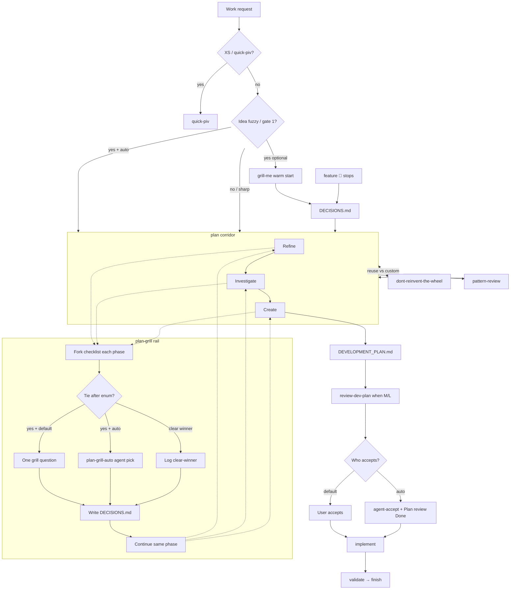

# Skill relationship flow (router sidecar)

**SSOT** for the grill → plan corridor → ship relationship diagram.  
`router` and `align-harness` **link here** — do not duplicate a second mermaid elsewhere.

**Owner:** `.agents/skills/router/references/skill-relationship-flow.md`  
**Maintainers:** update when skills are added/removed/renamed, or when handoffs between `grill-me` / `plan-grill` / `plan-grill-auto` / `plan` / `feature` / `pattern-review` / `dont-reinvent-the-wheel` / `quick-piv` change.  
**Checked on every** `/align-harness` run (Phase 0 need-check → later phase update if stale).

This file is the diagram SSOT. An IDE canvas is optional and is not part of this repo.

---

## Plan corridor + plan-grill rail

### Read rules

| Piece | Meaning |
|-------|---------|
| **grill-me** | Optional feeder into the ledger **before** the corridor |
| **plan-grill rail** | Beside **every** corridor phase — not a Create-only child |
| **plan-grill-auto** | Same checklist; agent picks on ties; skips Present; on M/L writes `agent-accept` and Plan review `Done`, then implement |
| **Loop** | ask *or* agent-pick → write `DECISIONS.md` → **continue the same phase** |
| **DECISIONS.md** | Product/scope locks (`plan-grill` / `plan-grill-auto` / `feature`) |
| **DEVELOPMENT_PLAN.md** | How to build |
| **review-dev-plan** | After the plan file when Complexity is M/L, before `implement` |
| **pattern-review** | Industry precedent side door. Auto mode picks internally; default mode stops for the owner |
| **dont-reinvent-the-wheel** | Package/pattern reuse side door (Investigate; before custom generic code) |
| **quick-piv** | No grill rail. If auto is already on, still no questions |
| **feature** | 🔴 stops. Auto does not enter `feature` unless the user invoked `/feature` |

Checklist/cues SSOT: [`.agents/skills/plan-grill/SKILL.md`](../../plan-grill/SKILL.md). Auto-answer variant: [`.agents/skills/plan-grill-auto/SKILL.md`](../../plan-grill-auto/SKILL.md).  
Prose routing: [router § Plan corridor flow](../SKILL.md).

---

## Stale-check criteria (`align-harness`)

Mark this file **needs update** when any of:

1. Skill added/removed/renamed that appears in the diagram or in router situation → skill for clarify/plan.
2. Handoff change among `grill-me`, `plan-grill`, `plan-grill-auto`, `plan`, `feature`, `pattern-review`, `dont-reinvent-the-wheel`, `quick-piv`, `implement`, `review-dev-plan`.
3. `DECISIONS.md` / corridor / rail semantics change in `plan-grill`, `plan-grill-auto`, or router § Plan corridor flow.
4. Composition lens finds a handoff edge in the live skill DAG that this mermaid omits or contradicts.

If none apply: record `skill-relationship-flow: current` in the reconcile summary and leave the file unchanged.
